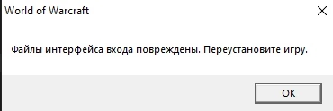

## Patch
> LoginScreen и окно создания персонажа с дополнения Shadowlands
> <a href="https://drive.google.com/file/d/18CQd-icSG6PiQutBG7zaGzNfknNGfHLA/view?usp=drivesdk" target="_blank">Скачать</a> и поместить файл в папку с игрой, по адресу../Data/ruRU

> <a href="https://drive.google.com/file/d/18Jg6thrwZd9K64OztZCsm1DgG_8Bdu9E/view?usp=drivesdk" target="_blank">Скачайте</a> пропатченный WoW.exe и замените свой, если выдает ошибку
<h3 align="center"></h3>
 
 
